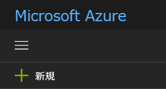

# Excersise.1 Azure App Service を作成する

## 概要
この演習では、Azure ポータルで必要なサービス [Azure Web App](https://azure.microsoft.com/ja-jp/services/app-service/web/) を作成します。

[ラボ概要](../README.md)

## 前提条件
この演習を完了するためには、以下のソフトウェア（もしくは互換機能のあるツール）が必要です。

## 前提条件
この演習を完了するためには、以下のソフトウェア（もしくは互換機能のあるツール）が必要です。

* [最新の MySQL Workbench](https://dev.mysql.com/downloads/workbench/)
* [WordPress](https://wordpress.org/download/)
* Microsoft Azure にインスタンス作成可能なサブスクリプション及びユーザーアカウント。
* Web ブラウザ
* [Cyberduck](https://cyberduck.io/)
* [Azure Cloud Shell](https://docs.microsoft.com/ja-jp/azure/cloud-shell/overview)

### 本手順の動作確認モジュールバージョン
* Windows 10 build 15063
* Google Chrome Version 60.0.3112.90 (Official Build) (64-bit)
* [pgAdmin 4 v1.6](https://www.postgresql.org/ftp/pgadmin/pgadmin4/v1.6/windows/)
* [MySQL Workbench 6.3.9 build 10690321](https://dev.mysql.com/downloads/workbench/)
* [WordPress 4.8.1](https://wordpress.org/download/)
* [Cyberduck Version 6.1.0 25371](https://cyberduck.io/)

## Task.1 Azure App Service を作成する
- ブラウザで [Azure Portal](http://portal.azure.com/)にアクセスします。

- 左上のメニューの＋新規をクリックします。

- 左の __New__ メニューで __Web + モバイル__ をクリックし、__Web App__ を選択します。

表示されていない場合は、左上の _Search the Marketplace_ に __Web App__ と入力し、検索して選択します。

- _Web App 作成_ メニューで下記を参考に入力します。

| 項目 | 概要 | 値の例 |
|:---------------------|:------------|:-------------|
| アプリ名              | Web アプリの名前を入力します。ユニークになるように設定します。 | cmsholmysql |
| サブスクリプション     | 利用するサブスクリプションを選択します。リソース作成が可能なものをあらかじめ準備しておきます。                       | Visual Studio Enterprise       |
| リソースグループ       | 利用するリソースグループ（アプリケーションの単位）を指定します。新規作成もできますが既存のものを使用することもできます | cmsholmysql   |
| OS                   | Web App のもとになる OS を選択します。      | Windows       |
| App Service プラン/場所 | App Service プランは、アプリのコンテナーとなります。App Service プランの設定によって、そのアプリの場所、機能、価格、およびコンピューティング リソースが決まります。新規作成も可能です。新規作成時にはどこにどのプランで作成するかを指定します。      | cmsholmysql |
| Application Insights | Application Insights による監視を有効にするかどうかを設定できます。 | OFF |

- しばらく（数分～数十分）待ってから、右上の通知の欄で、_デプロイメントが成功しました_ と表示されているのを確認します。

おつかれさまでした。以上で _Excercise.1_ は完了となります。

[次の演習　Excercise.2 DB を作成する](./Excercise2-CreateDB.md)

## 参考資料 
[Azure Marketplace から Web アプリを作成する](https://docs.microsoft.com/ja-jp/azure/app-service-web/app-service-web-create-web-app-from-marketplace)

__本情報の内容（添付文書、リンク先などを含む）は、作成日時点でのものであり、予告なく変更される場合があります。__
