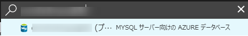

# Excersise.2 Azure database for MySQL を作成する

## 概要
この演習では、Azure ポータルで必要なサービス [Azure Database for MySQL](https://azure.microsoft.com/ja-jp/services/mysql/) を作成して必要な設定を行います。

[前の演習　Excercise.1 Azure App Service を作成する](./Excercise1-CreateServices.md)

## 前提条件
この演習を完了するためには、以下のソフトウェア（もしくは互換機能のあるツール）が必要です。

* [最新の MySQL Workbench](https://dev.mysql.com/downloads/workbench/)
* [WordPress](https://wordpress.org/download/)
* Microsoft Azure にインスタンス作成可能なサブスクリプション及びユーザーアカウント。
* Web ブラウザ
* [Cyberduck](https://cyberduck.io/)
* [Azure Cloud Shell](https://docs.microsoft.com/ja-jp/azure/cloud-shell/overview)

### 本手順の動作確認モジュールバージョン
* Windows 10 build 15063
* Google Chrome Version 60.0.3112.90 (Official Build) (64-bit)
* [MySQL Workbench 6.3.9 build 10690321](https://dev.mysql.com/downloads/workbench/)
* [WordPress 4.8.1](https://wordpress.org/download/)
* [Cyberduck Version 6.1.0 25371](https://cyberduck.io/)


## Task.1 Azure Database for MySQL を作成する
- ブラウザで [Azure Portal](http://portal.azure.com/)にアクセスします。

- 左上のメニューの＋新規をクリックします。
- 左の __New__ メニューで __Databases__ をクリックし、__Azure Database for MySQL__ を選択します。


- _MySQL サーバー_ メニューで下記を参考に入力します。

| 項目 | 概要 | 値の例 |
|:----------|:------------|:-------------|
| サーバー名 | データーベース サーバーの名前を入力します。ユニークになるように設定します。 | cmsholmysqldb |
| サブスクリプション | 利用するサブスクリプションを選択します。リソース作成が可能なものをあらかじめ準備しておきます。 | Visual Studio Enterprise |
| リソースグループ |  利用するリソースグループ（アプリケーションの単位）を指定します。新規作成もできますが既存のものを使用することもできます | cmsholmysql |
| サーバー管理者ログイン名 | サーバー管理者のログイン名を指定します。 | root |
| パスワード | パスワードを指定します。（プレビュー時はゆるい制約で指定可能でした。） | P@ssw0rd123 |
| パスワードの確認 | パスワードを指定します。（プレビュー時はゆるい制約で指定可能でした。） | P@ssw0rd123 |
| 場所 | 場所を指定します。 | 西日本 |
| バージョン | MySQL のバージョンを選択します。 | 5.7 |
| 価格レベル | 価格レベルを指定します。（プレビュー時は Basic のみ指定可能です。） | Basic |


- しばらく（数分～数十分）待ってから、右上の通知の欄で、_デプロイメントが成功しました_ と表示されているのを確認します。


## Task.2 MySQL に接続する
- ブラウザで [Azure Portal](http://portal.azure.com/)にアクセスします。
- ポータルの上部の__リソースの検索__ メニューで先ほど作成したデーターベース サーバー名を入力します。




- ポータルに表示された情報をメモします。

- メニューの__接続のセキュリティ__ をクリックします。


__注：執筆時点では Azure Database for MySQL はプレビューサービスです。Azure App Service で使用するすべてのIPアドレスを登録することができないため便宜上ファイアウォールを無効にしています。__

- __ファイアウォール規則__ に __任意の規則名__、 __開始IP__0.0.0.0、__終了IP__255.255.255.255 を入れたのち、__保存__をクリックします。
- __SSL 設定__ の__SSL 接続を強制する__を__無効__ にチェックをいれます。

<!-- 
- 上のメニューの __+自分の IP を追加__ をクリックしたのち __保存__ をクリックします。


 -->


| 項目 | 値 |
|:-----|:---|
| サーバー名 | _作成時に指定したサーバー名_.mysql.database.azure.com |
| サーバー管理者ログイン名 | _作成時に指定した管理者ログイン名_@_作成時に指定したサーバー名_ |
| パスワード | _作成時に指定したパスワード_ |

- MySQL Workbench を起動します。
- 左上の MySQL Connections の横の _(+)_ マークをクリックします。


- _Setup New Connection_ で先ほどメモをした情報をもとに接続情報を入力します。


- _Test Connection_ をクリックし、パスワードを入力して接続できるか確認します。


- 接続できたら、画面右上のをクリックし、下記の例のようにスキーマを作成します。

| 項目 | 内容 |値の例|
|:-----|:---|:---|
| Name | スキーマ名 | wordpress |
| Collation | 参照順序 | utf8-utf8_general_ci |


## Task.2+ MySQL に Azure Cloud Shell でアクセスする(Task.2 の別のやり方)

- Azure ポータル 右上の  をクリックし、Azure Cloud Shell を起動します。

```bash
    mysql -h データーベースサーバー名.mysql.database.azure.com -u 管理ユーザー名@データーベースサーバー名 -p
```

<!-- 下記ようなのエラーが表示されるのを確認します。


- Azure ポータル の メニューの__接続のセキュリティ__ をクリックします。


- 上のメニューの __ファイアウォール規則__ の __規則名, 開始 IP, 終了IP__ にエラーで表示された IP アドレスを指定したのち __保存__ をクリックします。


- 再度接続テストを実施します。 -->


- 下記の例のようなSQL文を実行してスキーマを作成します。
```sql
    CREATE SCHEMA `wordpress` DEFAULT CHARACTER SET utf8 ;
```

おつかれさまでした。以上で _Excercise.2_ は完了となります。

[次の演習　Excercise.3 Wordpress を設定する](./Excercise3-SetUpWP.md)

## 参考資料 

[Azure Database for MySQL](https://azure.microsoft.com/ja-jp/services/mysql/)

[最初の MySQL アカウントのセキュリティー設定](https://dev.mysql.com/doc/refman/5.6/ja/default-privileges.html)

[Azure Portal を使用した Azure Database for MySQL サーバーの作成](https://docs.microsoft.com/ja-jp/azure/mysql/quickstart-create-mysql-server-database-using-azure-portal)

[Azure で PHP と MySQL Web アプリを構築する](https://docs.microsoft.com/ja-jp/azure/app-service-web/app-service-web-tutorial-php-mysql)


__本情報の内容（添付文書、リンク先などを含む）は、作成日時点でのものであり、予告なく変更される場合があります。__