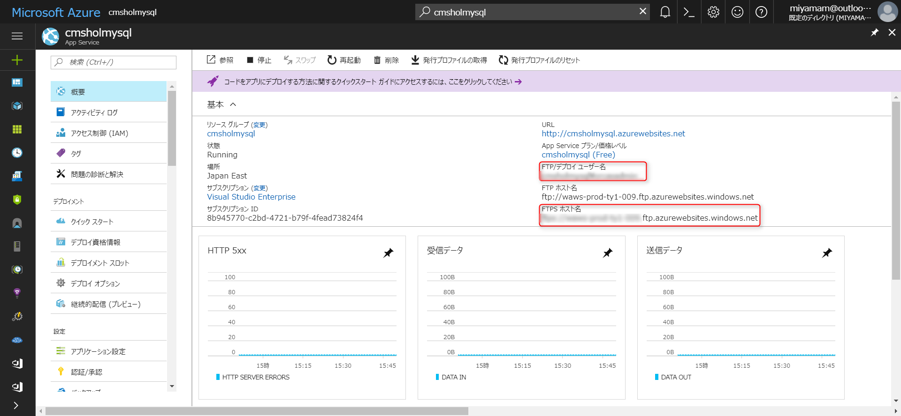
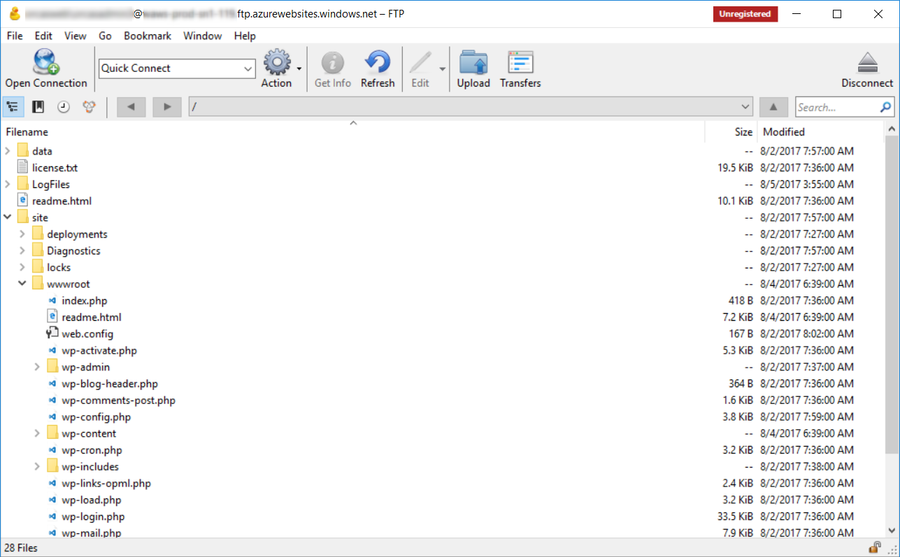
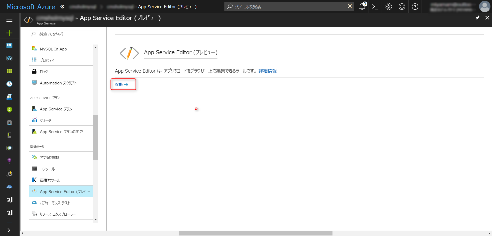
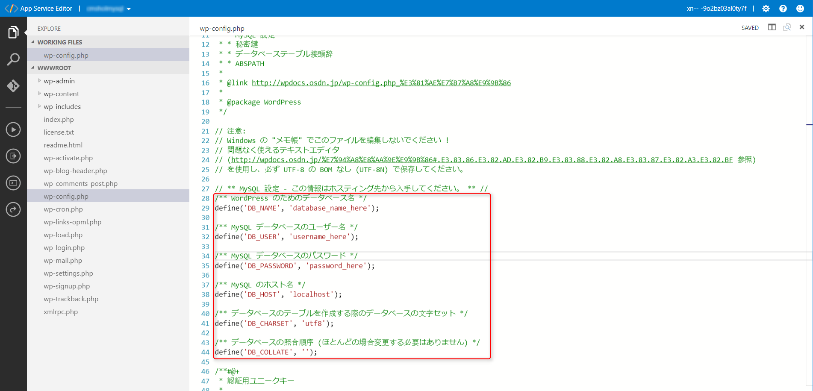
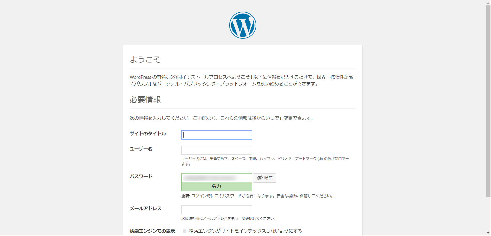

# Excersise.3 Wordpress を設定する

## 概要
この演習では、Wordpress の基本的な設定を行います。サイトに応じた詳細な設定は別途行ってください。
[前の演習　Excercise.2 DB を作成する](./Excercise2-CreateDB.md)

## 前提条件
この演習を完了するためには、以下のソフトウェア（もしくは互換機能のあるツール）が必要です。

* [最新の MySQL Workbench](https://dev.mysql.com/downloads/workbench/)
* [WordPress](https://wordpress.org/download/)
* Microsoft Azure にインスタンス作成可能なサブスクリプション及びユーザーアカウント。
* Web ブラウザ
* [Cyberduck](https://cyberduck.io/)
* [Azure Cloud Shell](https://docs.microsoft.com/ja-jp/azure/cloud-shell/overview)

### 本手順の動作確認モジュールバージョン
* Windows 10 build 15063
* Google Chrome Version 60.0.3112.90 (Official Build) (64-bit)
* [MySQL Workbench 6.3.9 build 10690321](https://dev.mysql.com/downloads/workbench/)
* [WordPress 4.8.1](https://wordpress.org/download/)
* [Cyberduck Version 6.1.0 25371](https://cyberduck.io/)

## Task.0 Wordpress のファイルを準備しておく
- Wordpress のファイルをダウンロードしたものをフォルダごと解凍しておきます。
- 解凍したファイルの__wp-config-sample.php__ を __wp-config.php__ にリネームします。

## Task.1 Wordpress のファイルをアップロードする
- ブラウザで [Azure Portal](http://portal.azure.com/)にアクセスします。

- ポータルの上部の __リソースの検索__ メニューで Excercise1 で作成した Azure App Service を入力します。


* __App Services Plan ではなく、App Services を選択します。__

- 左側のメニューで__デプロイ資格情報__ を選択します。
__FTP/デプロイ ユーザー名__と__パスワード__を入力して、左上の__保存__をクリックします。
* 2回目以降は __FTP/デプロイ ユーザー名__ を変更する必要があります。

- 左側のメニューで__概要__を選択します。__FTP/デプロイ ユーザー名__ と__FTPS ホスト名__ をメモします。(FTPSの代わりにFTPを使用する場合は__FTP ホスト名__をメモします。)


- __Cyberduck__ を起動し、先ほどメモした情報で接続します。
__site__ の下の__wwwroot__ を開き、__hostingstart.html__を右クリックメニュー__Delete__で削除し、__Task.0__で解凍したファイルをドラッグアンドドロップしてアップロードします。


## Task.2 MySQL との接続情報を入力する
- ブラウザで [Azure Portal](http://portal.azure.com/)にアクセスします。

- ポータルの上部の __リソースの検索__ メニューで Excercise1 で作成した Azure App Service を入力します。


* __App Services Plan ではなく、App Services を選択します。__

- 左側のメニューの __開発ツール__ の __App Service Editor (プレビュー)__ を開きます。



- 左側の一番上の__EXPLOREアイコン__を選択し、左側2番目のところで、__WWWROOT__ フォルダ以下の __wp-config.php__ ファイルを選択します。


下記の例を参考に、[Excercise.2](./Excercise2-CreateDB.md)で設定したDBの情報を入力します。

```php
    // ** MySQL 設定 - この情報はホスティング先から入手してください。 ** //
/** WordPress のためのデータベース名 (作成したスキーマ名）*/
define('DB_NAME', 'wordpress');

/** MySQL データベースのユーザー名（サーバー管理者ログイン名） */
define('DB_USER', 'root@cmsholdb');

/** MySQL データベースのパスワード */
define('DB_PASSWORD', 'P@ssw0rd123!');

/** MySQL のホスト名 （作成時に指定したサーバー名.mysql.database.azure.com）*/
define('DB_HOST', 'cmsholdb.mysql.database.azure.com');

/** データベースのテーブルを作成する際のデータベースの文字セット */
define('DB_CHARSET', 'utf8');

/** データベースの照合順序 (ほとんどの場合変更する必要はありません) */
define('DB_COLLATE', '');

/**#@+
 * 認証用ユニークキー
 *
 * それぞれを異なるユニーク (一意) な文字列に変更してください。
 * {@link https://api.wordpress.org/secret-key/1.1/salt/ WordPress.org の秘密鍵サービス} で自動生成することもできます。
 * 後でいつでも変更して、既存のすべての cookie を無効にできます。これにより、すべてのユーザーを強制的に再ログインさせることになります。
 *
 * @since 2.6.0
 */
define('AUTH_KEY',         'Un1QuePhr@se1');
define('SECURE_AUTH_KEY',  'Un1QuePhr@se2');
define('LOGGED_IN_KEY',    'Un1QuePhr@se3');
define('NONCE_KEY',        'Un1QuePhr@se4');
define('AUTH_SALT',        'Un1QuePhr@se5');
define('SECURE_AUTH_SALT', 'Un1QuePhr@se6');
define('LOGGED_IN_SALT',   'Un1QuePhr@se7');
define('NONCE_SALT',       'Un1QuePhr@se8');

/**#@-*/
```

- ブラウザで、_Excercise.1_ で作成した__App Service__のURLにアクセスします。
　下記のような画面が表示されたら任意の情報で初期設定を行います。


おつかれさまでした。以上で _Excercise.3_ は完了となります。

[次の演習　Excercise.4 Azure CDN を設定する](./Excercise4-CDNSetUp.md)

## 参考資料 

[Azure App Service のデプロイ資格情報の構成](https://docs.microsoft.com/ja-jp/azure/app-service-web/app-service-deployment-credentials)

[wp-config.php の編集](https://wpdocs.osdn.jp/wp-config.php_%E3%81%AE%E7%B7%A8%E9%9B%86)


__本情報の内容（添付文書、リンク先などを含む）は、作成日時点でのものであり、予告なく変更される場合があります。__