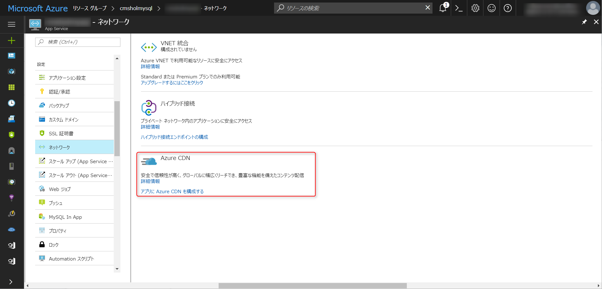
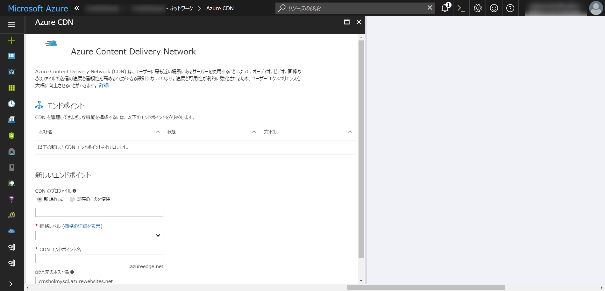
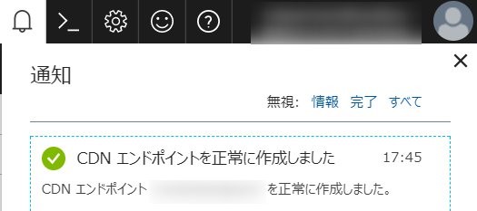

# Excercise.4 Azure CDN を設定する

## 概要
この演習では、Azure CDN を使用して、作成した Wordpress のコンテンツをキャッシュし、ユーザーへのコンテンツ配信のスループットを向上させます。サイトに応じた詳細な設定は別途行ってください。
[前の演習　Excercise.3 Wordpress を設定する](./Excercise3-SetUpWP.md)

## 前提条件
この演習を完了するためには、以下のソフトウェア（もしくは互換機能のあるツール）が必要です。

* [最新の MySQL Workbench](https://dev.mysql.com/downloads/workbench/)
* [WordPress](https://wordpress.org/download/)
* Microsoft Azure にインスタンス作成可能なサブスクリプション及びユーザーアカウント。
* Web ブラウザ
* [Cyberduck](https://cyberduck.io/)
* [Azure Cloud Shell](https://docs.microsoft.com/ja-jp/azure/cloud-shell/overview)

### 本手順の動作確認モジュールバージョン
* Windows 10 build 15063
* Google Chrome Version 60.0.3112.90 (Official Build) (64-bit)
* [MySQL Workbench 6.3.9 build 10690321](https://dev.mysql.com/downloads/workbench/)
* [WordPress 4.8.1](https://wordpress.org/download/)
* [Cyberduck Version 6.1.0 25371](https://cyberduck.io/)

## Task.1 Azure CDN を設定
- ブラウザで [Azure Portal](http://portal.azure.com/)にアクセスします。

- ポータルの上部の __リソースの検索__ メニューで Excercise1 で作成した Azure App Service を入力します。

* __App Services Plan ではなく、App Services を選択します。__

- 左側のメニューで__ネットワーク__ を選択します。
- __アプリに Azure CDN を構成する__ をクリックします。

- 今回は、CDNのプロファイルを新規作成します。

| 項目 | 概要 | 値の例 |
|:----------|:------------|:-------------|
| CDNのプロファイル | CDNのプロファイル | cmsholendpoint |
| 価格レベル | CDN の価格レベルを選択します |　Standard Akamai |
| CDN エンドポイント | CDN のエンドポイントを設定します。ユニークになる必要があります。 | cmsholendpoint.azureedge.net|
| 配信元のホスト名 | Excercise1 で作成した App Service のホスト名が自動入力されます。| cmshol.azurewebsites.net |

- 
>既定では、1 つの Azure サブスクリプションは8 つの CDN プロファイルに限定されます。 
>各 CDN プロファイルは 10 個の CDN エンドポイントに制限されます。
>CDN の価格は、CDN プロファイル レベルで適用されます。 
>Azure CDN の価格レベルを組み合わせて使用する場合は、複数の CDN プロファイルが必要になります。

- しばらく（数分～数十分）待ってから、右上の通知の欄で、_デプロイメントが成功しました_ と表示されているのを確認します。

- ブラウザを起動し、CDN エンドポイントにアクセスします。
- 先ほど作成したサイトの内容と一致しているか、更新しながら確認をします。

おつかれさまでした。以上で _Excercise.4_ は完了となります。

## 参考資料 

[Azure Content Delivery Network (CDN) の概要](https://docs.microsoft.com/ja-jp/azure/cdn/cdn-overview)

__本情報の内容（添付文書、リンク先などを含む）は、作成日時点でのものであり、予告なく変更される場合があります。__